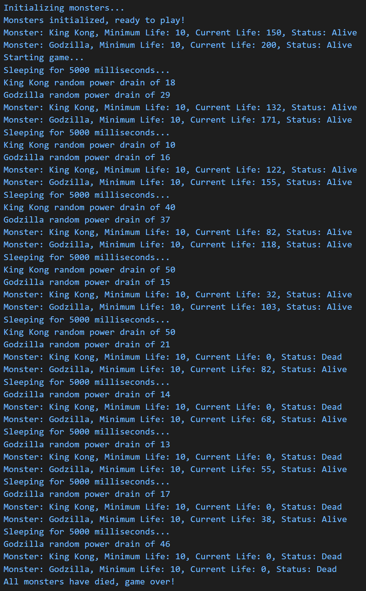

## Functionality

Creation of Monster Game program using classes. The game will create monsters with initial life values, and minimum life values for the monster to be alive. Once the game is running, each monster's life will be drained by a random amount, and the game will continue until all of the monsters have died.

### Purpose

- Gain experience working with classes, including class constructors and methods
- Interpreting existing code to design and build additional classes, including constructor and methods
- Using VSCode to execute and debug Node.js code, including module breakpoints
- Work with Array map() and forEach() methods along with the concept of a gaming loop
- Gain more experience working with objects and arrays

[files for Monster Game](https://github.com/Jiah-design/cit281-p5)

